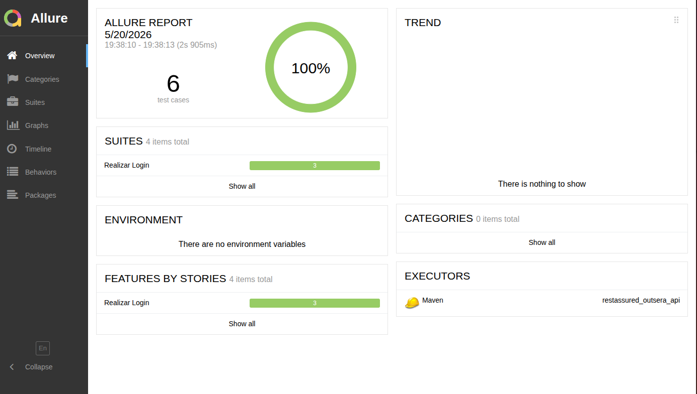

# Outsera Desafio QE - Testes de API com Rest Assured

Projeto de automacao de testes de API utilizando Java, JUnit 5, Cucumber BDD e Rest Assured, com execucao em CI no GitHub Actions e publicacao de relatorio Allure no GitHub Pages.

## Sumario

- [Objetivo](#objetivo)
- [Stack](#stack)
- [Pre-requisitos](#pre-requisitos)
- [Estrutura do projeto](#estrutura-do-projeto)
- [Padroes de projeto adotados](#padroes-de-projeto-adotados)
- [Como executar localmente](#como-executar-localmente)
- [CI/CD no GitHub Actions](#cicd-no-github-actions)
- [Relatorios](#relatorios)
- [Boas praticas aplicadas](#boas-praticas-aplicadas)
- [Riscos e limitacoes](#riscos-e-limitacoes)
- [Comandos uteis](#comandos-uteis)

## Objetivo

Validar endpoints da API `dummyjson` cobrindo:

- cenarios positivos (sucesso),
- cenarios negativos (erros esperados),
- estrutura basica de contrato (campos obrigatorios e tipos),
- autenticacao e endpoints protegidos.

Os testes sao escritos em dois estilos complementares: testes unitarios com JUnit 5 e testes BDD com Cucumber em portugues.

## Stack

| Tecnologia              | Versao  |
|-------------------------|---------|
| Java                    | 17      |
| Maven                   | 3.9+    |
| JUnit Jupiter           | 5.10.3  |
| Rest Assured            | 6.0.0   |
| JSON Schema Validator   | 6.0.0   |
| Allure Report           | 2.30.0  |
| Cucumber Java + JUnit   | 7.34.3  |
| dotenv-java             | 3.0.0   |
| GitHub Actions          | —       |

## Pre-requisitos

- Java 17
- Maven 3.9+
- Credenciais via arquivo `.env` ou variaveis de ambiente para testes autenticados:

```bash
# .env (baseie-se no .env.example)
API_USER=your_user
API_PASS=your_password
```

## Estrutura do projeto

```text
src/test/java/
  base/
    BaseApiTest.java          # configuracao global: base URI, carregamento de credenciais
  dummyjson/
    GetAuthProductsTest.java  # testes GET /auth/products (autenticado)
    PostAuthProductsTest.java # testes POST /auth/login
  maps/
    LoginMap.java             # mapa de payload de login
  runner/
    RunnerTest.java           # runner Cucumber (JUnit 4)
  steps/
    AssertSteps.java          # steps de assertiva reutilizaveis
    AuthProductsSteps.java    # steps de login e autenticacao
  utils/
    RestUtils.java            # wrapper para chamadas REST (GET/POST)

src/test/resources/features/
  AuthProducts.feature        # cenarios BDD de login em portugues
  GetAuthProductsTest.feature # cenarios BDD de produtos autenticados
```

## Padroes de projeto adotados

- **Classe base** (`BaseApiTest`): centraliza configuracao da base URI e resolucao de credenciais com fallback em tres niveis: system property → variavel de ambiente → arquivo `.env`.
- **Utilitario HTTP** (`RestUtils`): encapsula chamadas REST Assured (GET/POST), mantendo resposta acessivel entre steps Cucumber.
- **Mapa de payload** (`LoginMap`): isola montagem do corpo de requisicao de login.
- **BDD em portugues** (Cucumber + `.feature`): cenarios escritos com `Dado / Quando / Entao` para maior legibilidade.
- **Convencao de nomes** JUnit no padrao `should...when...`.
- **Externalizacao de credenciais**: sem hardcode de usuario/senha no codigo.

Sobrescrever base URL:

```bash
mvn test -Dbase.url=https://dummyjson.com/
```

Sobrescrever credenciais:

```bash
mvn test -Dapi.user=seu_usuario -Dapi.pass=sua_senha
```

## Como executar localmente

### 1) Executar todos os testes

```bash
mvn clean test
```

### 2) Gerar relatorio Allure

```bash
mvn -DskipTests -Dallure.results.directory=allure-results allure:report
```

### 3) Visualizar relatorio

Abra no navegador:

```
target/site/allure-maven-plugin/index.html
```

Exemplo do relatorio Allure:



## CI/CD no GitHub Actions

Pipeline configurado em `.github/workflows/ci.yml` com 3 jobs:

| Job      | Trigger                   | O que faz                                                      |
|----------|---------------------------|----------------------------------------------------------------|
| `test`   | push / pull request       | `mvn clean test`, publica artefatos surefire + allure-results  |
| `report` | apos `test` (sempre)      | baixa artefato, gera HTML do Allure e publica como artefato    |
| `deploy` | apos `report` (so `main`) | publica o relatorio no GitHub Pages                            |

### Segredos necessarios no repositorio

Configure em **Settings > Secrets and variables > Actions**:

| Secret     | Descricao              |
|------------|------------------------|
| `API_USER` | Usuario da API de login |
| `API_PASS` | Senha da API de login   |

## Relatorios

- **Artefatos do job `report`**: HTML completo do Allure disponivel por 7 dias em cada execucao.
- **GitHub Pages**: relatorio publicado automaticamente a cada push na branch `main`.

## Boas praticas aplicadas

- Centralizacao de configuracao da base URI
- Separacao de testes por dominio funcional
- Dupla abordagem de testes: JUnit 5 (assertivas diretas) e Cucumber BDD (legibilidade de negocio)
- Cobertura de cenarios positivos e negativos
- Validacao de contrato: campos obrigatorios, tipos de dados e formatos de data ISO
- Integracao continua via GitHub Actions
- Publicacao de relatorio Allure no GitHub Pages
- Credenciais externalizadas (sem hardcode)

## Riscos e limitacoes

- Os testes dependem de API externa (`dummyjson`) e podem oscilar por indisponibilidade ou mudancas de contrato.
- Como e uma API de terceiros, nao ha controle sobre massa de dados.
- Alguns cenarios negativos do `POST /auth/login` retornam `400` em vez do esperado `401` — comportamento documentado nos testes.

## Comandos uteis

```bash
# Rodar todos os testes
mvn clean test

# Rodar com URL customizada
mvn test -Dbase.url=https://dummyjson.com/

# Rodar com credenciais via system property
mvn test -Dapi.user=seu_usuario -Dapi.pass=sua_senha

# Gerar relatorio sem reexecutar testes
mvn -DskipTests -Dallure.results.directory=allure-results allure:report
```

## Autor

Fernando Pimentel de Oliveira